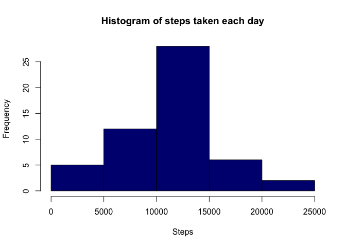
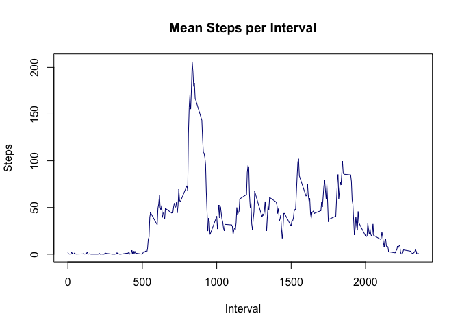
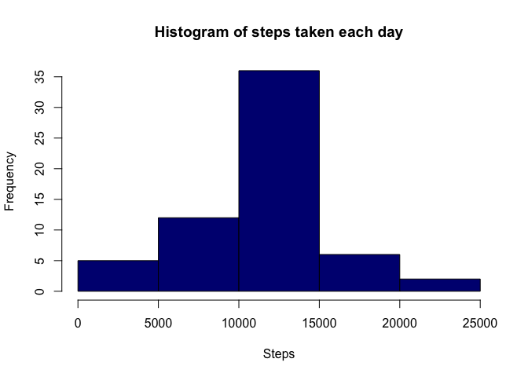

# Reproducible Research: Peer Assessment 1


## Loading and preprocessing the data

```r
data <- read.csv("activity.csv")
```

Using lubridate package to process date data appropriately

```r
library(lubridate)
data$date <- ymd(data$date)
```

## What is mean total number of steps taken per day?
Plot the histogram of steps taken each day. First we calculate the sum for each day and then
we plot the histogram.


```r
stepsPerDay <- tapply(data$steps,data$date,sum)
hist(stepsPerDay, col = "navyblue", main="Histogram of steps taken each day",
     xlab="Steps")
```

 

We calculate the mean and the median of steps taken


```r
mean(stepsPerDay,na.rm=TRUE)
```

```
## [1] 10766.19
```

```r
median(stepsPerDay,na.rm=TRUE)
```

```
## [1] 10765
```


## What is the average daily activity pattern?
First we need to create a variable that holds the mean steps for each interval.
Then we plot the newly created data.

```r
stepsOnIntervals <- aggregate(steps ~ interval,data = data, mean, na.rm = TRUE)
plot(stepsOnIntervals$interval,stepsOnIntervals$steps, main="Mean Steps per Interval", col ="navyblue",
     type ="l", ylab="Steps", xlab="Interval")
```

 

The interval that contains the on average the maximum number of steps during the day is:

```r
stepsOnIntervals[which(stepsOnIntervals$steps == max(stepsOnIntervals$steps)),]
```

```
##     interval    steps
## 104      835 206.1698
```
This is clear from the plot as well.

## Imputing missing values
The number of missing values is calculated next.

```r
nas <- table(is.na(data$steps))
as.numeric(nas[2])
```

```
## [1] 2304
```

There are a total of 2304 missing values in the data.

Next we fill out the missing values by matching the average activity of the interval to missing value.
A new data set called "newData" is created in the process. The way the matching is done is
by adding a new column keeping the mean interval step values on the fourth column.
This column could be removed later if need be.


```r
newData <- cbind(data,stepsOnIntervals$steps)
for(k in 1:nrow(newData)){
    if(is.na(newData[k,1])){
        newData[k,1] <- newData[k,4]
    }
}
summary(newData)
```

```
##      steps             date               interval     
##  Min.   :  0.00   Min.   :2012-10-01   Min.   :   0.0  
##  1st Qu.:  0.00   1st Qu.:2012-10-16   1st Qu.: 588.8  
##  Median :  0.00   Median :2012-10-31   Median :1177.5  
##  Mean   : 37.38   Mean   :2012-10-31   Mean   :1177.5  
##  3rd Qu.: 27.00   3rd Qu.:2012-11-15   3rd Qu.:1766.2  
##  Max.   :806.00   Max.   :2012-11-30   Max.   :2355.0  
##  stepsOnIntervals$steps
##  Min.   :  0.000       
##  1st Qu.:  2.486       
##  Median : 34.113       
##  Mean   : 37.383       
##  3rd Qu.: 52.835       
##  Max.   :206.170
```

We plot the histogram of steps taken each day. First we calculate the sum for each day and then
we plot the histogram.


```r
stepsPerDay2 <- tapply(newData$steps,newData$date,sum)
hist(stepsPerDay2, col = "navyblue", main="Histogram of steps taken each day",
     xlab="Steps")
```

 

We calculate the mean and the meadian of steps taken


```r
mean(stepsPerDay2)
```

```
## [1] 10766.19
```

```r
median(stepsPerDay2)
```

```
## [1] 10766.19
```

The is some difference to the data having missing values on the median (by contruction there
is no difference to mean!). Lets calculate the differences for
mean and median values.

```r
mean(stepsPerDay2) - mean(stepsPerDay,na.rm=TRUE)
```

```
## [1] 0
```

```r
median(stepsPerDay2) - median(stepsPerDay,na.rm=TRUE)
```

```
## [1] 1.188679
```

That is, filling the missing values, raises the meadian steps by a little more than one step.


## Are there differences in activity patterns between weekdays and weekends?
Let's first change the date column to weekday form and then create a factor variable for weekends. Then calculate the new aggregated variable with the new weekend variable
put in.

```r
newData$date <- weekdays(newData$date,TRUE)
newData$weekday <- 1
for(i in 1:nrow(newData)){
    if(newData[i,2]=="Sat" | newData[i,2] == "Sun"){
        newData[i,5] <- "Weekend"
    } else {
        newData[i,5] <- "Weekday"
    }
}
newData$weekday <- factor(newData$weekday)
stepsOnIntervals2 <- aggregate(steps ~ interval + weekday, data= newData, mean)
```

Let's fire up lattice plotting system

```r
library(lattice)
xyplot(steps ~ interval | weekday,type = "l", data = stepsOnIntervals2, layout = c(1,2))
```

 

### Some speculation on the graph

As indicated by the plot the weekends have more smooth activity pattern, this might
be because on weekdays the subject is working (office job, sitting etc.) and during
weekends there is no need to be as passive during this period.

